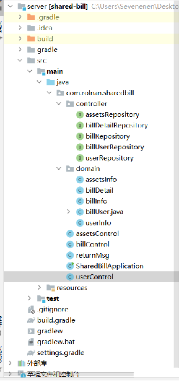
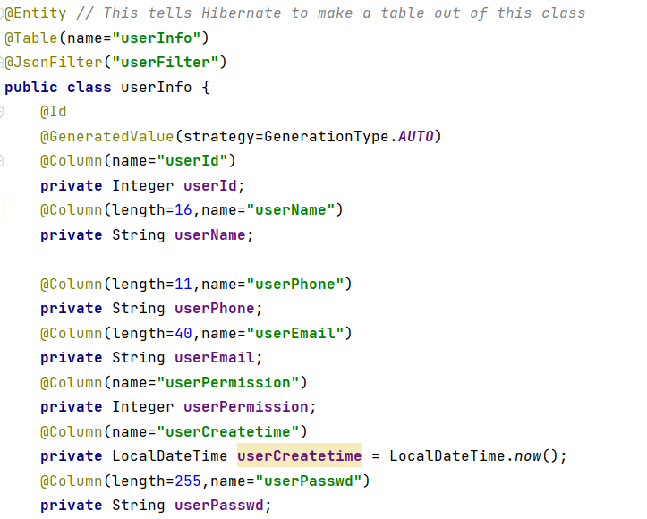
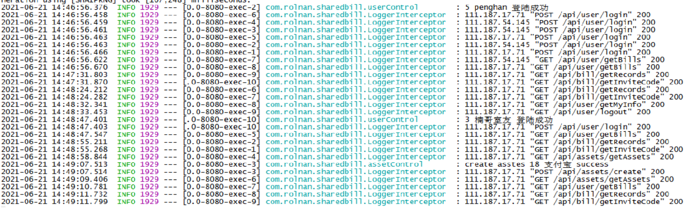
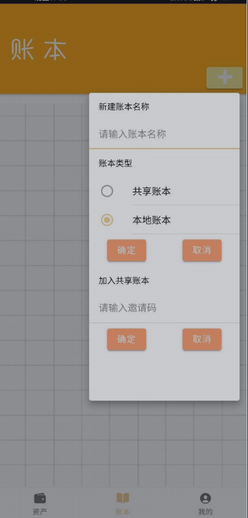

## 软件工程课程项目，共享账本

### 前端实现

#### 使用ionic+vue实现

- Ionic：可使用封装好的前端UI小组件，如按钮、导航栏、popover弹出框等，实现美观多样的界面
- Vue：和ionic结合使用，实现页面间的跳转与传值、事件响应、与后端的数据交互等内部逻辑

***

### 后端实现

- 语言：Java

- 框架：SprintBoot + Hibernate

- 数据库：在Hibernate框架的基础上通过ORM技术实现Java与MySQL之间的交互

  

  

- 详细日志

  

***

### 服务端部署文件

#### **java安装**

- 安装java11

- 安装IntelliJ IDEA Community Edition 2021.1.1 x64（推荐）

**打包**

- 使用编译器打开server包，使用springboot自带的构建脚本指令bootjar

- 在“shared-bill\server\build\libs”下会生成shared-bill-0.0.1-SNAPSHOT.jar

- 将该文件上传至服务器

#### **后端部署，以centos8为例（华为弹性云）**

**tmux安装**

- 使用yum install tmux安装tmux

**java安装**

- 使用yum install java-11* 安装java相关包

- 使用yum install *openjdk* 安装java相关包

**数据库安装**

- 使用yum install mariadb-server 安装

- 使用systemctl start mariadb 启动

- 第一次使用需要mysql_secure_installation 初始化

- 创建db_example的数据库 create database db_example;

- 创建指定用户 create user 'springuser'@'%' identified by 'ThePassword';

- 给定权限 grant all privileges on 'db_example'.* to 'springuser'@'%';

- 刷新权限 flush privileges;

**运行**

- 切换到服务器shared-bill-0.0.1-SNAPSHOT.jar文件的目录下

  - 进入会话

    - 第一次需要使用tmux new -s session -d创建会话

    - 之后使用tmux attach进入会话即可使用/usr/lib/jvm/jre-11/bin/java -jar shared-bill-0.0.1-SNAPSHOT.jar运行

***

### 操作说明

- 安装
  - 下载“shared-bill.apk”
  - 点击 apk 进行安装
- 运行
  - 点击“shared-bill”APP 运行程序

- 登录/注册

  - 进入登录界面

    

  - 注册新账号
    - 点击注册账号按钮
    - 输入相关信息进行注册(错误提示)
    - 点击发送验证码按钮
    - 输入验证码（邮箱中）

- 资产设置

  - 新增资产

    

  - 查看资产

  - 修改资产

- 账本管理

  - 新增本地账本

    

    

  - 查看本地账本

    - 添加账单

  - 查看账单

  - 添加共享账本

  - 查看共享账本

  - 清算共享账本

